# Visual Reference RAG

**English** | [简体中文](README.zh-CN.md)

A project-scoped visual RAG workflow for turning temporary moodboards into grounded, traceable image-generation context.

Visual Reference RAG is a reusable Codex Skill for designers who build a different reference library for every project. Instead of treating all collected images as one permanent knowledge base, it catalogs each project's references, retrieves a small complementary set, converts the selection into a structured Style Spec, and records the generation run.

> 用项目级视觉素材库驱动生图：每次设计更换素材库，Skill 本身保持不变。

## Why this exists

Sending an entire moodboard to an image model often produces averaged, inconsistent results. This project separates the workflow into four responsibilities:

- The project folder stores source references and provenance.
- Deterministic scripts handle cataloging, deduplication, retrieval, reranking, and run manifests.
- Codex performs visual semantic annotation and design judgment.
- The image-generation tool receives only 3-5 selected references with explicit roles.

## Capabilities

- Exact duplicate detection with SHA-256.
- Near-duplicate detection with perceptual hashing.
- Image dimensions, orientation, palette, brightness, and saturation extraction.
- Contact-sheet generation for exhaustive visual review.
- Structured semantic annotations for composition, color, typography, texture, lighting, mood, and subject.
- Bilingual design-vocabulary query expansion.
- Weighted metadata retrieval with optional image-text embeddings.
- Diversity reranking inspired by maximal marginal relevance.
- Reference-role coverage across composition, color, typography, texture, lighting, subject, and layout.
- Grounded Style Spec generation and reproducible run manifests.
- Retrieval and generation evaluation guidance.

## Architecture

```mermaid
flowchart LR
    A["Design brief"] --> B["Catalog and deduplicate"]
    B --> C["Visual annotation"]
    C --> D["High-recall candidates"]
    D --> E["Diversity and role reranking"]
    E --> F["3-5 grounded references"]
    F --> G["Style Spec"]
    G --> H["Image generation"]
    H --> I["Evaluation and run manifest"]
```



## Retrieval strategy

| Stage | Approach |
| --- | --- |
| Corpus quality | File hashes, perceptual hashes, unreadable-file detection, provenance fields |
| Small libraries | Exhaustive review for 40 or fewer active images to avoid first-stage recall loss |
| Candidate recall | Bilingual query expansion and weighted semantic/visual metadata |
| Optional vector recall | Cosine similarity when catalog and query use vectors from the same embedding model |
| Precision | Field weighting, constraints, duplicate grouping, and low-score warnings |
| Diversity | Similarity penalties prevent one visual pattern from occupying every result |
| Coverage | Final references are rewarded for covering different design roles |
| Augmentation | Style Spec connects each design rule to the brief or a selected reference |
| Auditability | Retrieval JSON and run manifests preserve scores, paths, and file digests |

The default mode does not pretend to include a bundled CLIP/SigLIP model. It works with semantic annotations and visual metadata. Projects can add compatible embeddings through the documented `embedding` field and `--query-embedding` option.

## Requirements

- Python 3.10 or later.
- Pillow 10 or later.
- Codex with local image inspection and an available image-generation tool for the complete workflow.

Install the Python dependency:

```bash
python -m pip install -r requirements.txt
```

## Install as a Codex Skill

### Windows

```powershell
git clone https://github.com/suli062777-oss/visual-reference-rag.git "$HOME\.codex\skills\visual-reference-rag"
```

### macOS or Linux

```bash
git clone https://github.com/suli062777-oss/visual-reference-rag.git ~/.codex/skills/visual-reference-rag
```

Open a new Codex task after installation so the Skill list refreshes.

## Quick start

Initialize a project:

```bash
python scripts/visual_reference_rag.py init --project /path/to/tavern-poster
```

Place collected images under:

```text
/path/to/tavern-poster/references/raw/
```

Catalog the material and create contact sheets:

```bash
python scripts/visual_reference_rag.py catalog --project /path/to/tavern-poster
```

Ask Codex to inspect the contact sheets and write `analysis/annotations.json`, then merge the validated annotations:

```bash
python scripts/visual_reference_rag.py annotate \
  --project /path/to/tavern-poster \
  --annotations /path/to/tavern-poster/analysis/annotations.json
```

Retrieve complementary references:

```bash
python scripts/visual_reference_rag.py retrieve \
  --project /path/to/tavern-poster \
  --query "Dark editorial tavern event poster with warm accents" \
  --top-k 5 \
  --candidate-k 20 \
  --copy-selected
```

The Skill then builds `analysis/style-spec.json`, calls the available image-generation tool with the selected local files, evaluates the output, and records the run.

## Example Codex prompt

```text
Use $visual-reference-rag.

Project directory: D:\design-projects\tavern-poster
Goal: Create a 3:4 recruitment poster for an Agent tavern meetup.

Initialize the project and analyze references/raw.
Deduplicate and annotate the material, retrieve complementary references,
show which image contributes composition, color, typography, and texture,
then produce a grounded Style Spec before image generation.
```

## Project layout

```text
project/
|-- brief.md
|-- references/
|   |-- raw/
|   `-- selected/
|-- catalog/
|   `-- assets.jsonl
|-- analysis/
|   |-- contact-sheets/
|   |-- annotations.json
|   |-- retrieval-*.json
|   `-- style-spec.json
|-- outputs/
`-- runs/
```

See [the data contract](references/data-contract.md) for schemas and [retrieval and evaluation guidance](references/retrieval-and-evaluation.md) for failure handling and quality metrics.

## Evaluation

For reusable libraries, measure:

- Recall at the candidate cutoff.
- Precision of the final selected references.
- Requested design-role coverage.
- Duplicate rate in the selected set.
- Style Spec grounding coverage.
- Brief accuracy, layout usability, originality, and artifact quality after generation.

For small one-off moodboards, exhaustive inspection plus a clear selection rationale is usually more reliable than introducing a heavyweight vector database.

## Current limitations

- No image embedding model is bundled; vector generation must be supplied by one consistent external model.
- Semantic annotations still depend on the quality of visual inspection.
- Final long-form typography should be completed in a layout tool when text accuracy matters.
- Source images require provenance and rights review; public availability does not imply reuse permission.
- The workflow reduces unsupported style drift but cannot guarantee that every image model follows every reference role.

## Roadmap

- Optional CLIP/SigLIP indexing adapter.
- Automated retrieval evaluation command.
- Configurable project-level hard filters.
- Generation-provider adapters.
- Figma-ready layout handoff.

## License

No open-source license has been selected yet. Public visibility does not grant reuse rights beyond GitHub's applicable terms.
