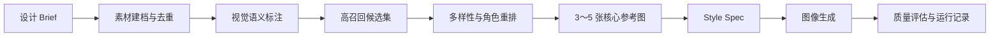

# Visual Reference RAG

[English](README.md) | **简体中文**

一个面向设计素材库的项目级 Visual RAG 工作流：把临时收集的 Moodboard 转化为可检索、可解释、可追溯的生图上下文。

Visual Reference RAG 是一个可复用的 Codex Skill，适合“每次设计任务都会重新收集一批参考图”的工作方式。它不会要求你维护一个固定的大型风格库，而是让每个项目拥有独立素材库，再完成素材建档、视觉理解、参考图召回、重排、Style Spec 提炼、生图和运行记录。

> 项目更换，素材库随之更换；检索和生成流程由同一个 Skill 复用。

## 为什么需要它

直接把整个 Moodboard 交给生图模型，通常会遇到几个问题：

- 参考图过多，模型无法判断你喜欢每张图的哪一部分。
- 相似图片重复占用上下文，最后得到被平均化的视觉风格。
- 构图、配色、字体和材质混在一起，缺少明确的参考分工。
- 生成结果缺乏来源记录，后续很难复现或解释。
- 网上收集的素材可能包含重复图、低质量图和授权不明确的内容。

这个项目把工作拆成四层：

- 项目素材库负责保存原始参考图和来源信息。
- 确定性脚本负责建档、去重、召回、重排和运行记录。
- Codex 负责视觉语义标注、设计判断和 Style Spec 提炼。
- 生图工具只接收最终筛选出的 3～5 张互补参考图。

## 核心能力

- 使用 SHA-256 识别完全重复图片。
- 使用感知哈希识别裁切、压缩、缩放后的近重复图片。
- 提取图片尺寸、方向、比例、主色、亮度和饱和度。
- 自动生成素材联系表，支持 Codex 全量视觉检查。
- 标注构图、配色、字体、材质、光线、氛围、主体和适用角色。
- 对中英文设计词汇进行查询扩展。
- 支持语义标签、视觉元数据和可选向量的混合召回。
- 使用多样性重排，避免最终参考图高度雷同。
- 检查构图、色彩、字体、材质等参考角色是否完整。
- 生成有依据的 Style Spec。
- 保存检索结果、参考图、文件哈希和生图运行记录。
- 提供召回与生成质量的评估方法。

## 工作架构



## RAG 是如何工作的

| 环节 | 处理方式 |
| --- | --- |
| 素材质量 | 文件哈希、感知哈希、损坏文件检测和来源字段 |
| 小型素材库 | 40 张以内进行全量视觉检查，避免第一阶段漏召回 |
| 候选召回 | 中英文查询扩展，加权检索描述、标签和视觉属性 |
| 可选向量召回 | 素材和查询使用同一视觉向量模型时混合余弦相似度 |
| 精度控制 | 字段权重、条件限制、重复分组和低分警告 |
| 多样性 | 对相似候选进行惩罚，避免单一视觉模式占满结果 |
| 角色覆盖 | 奖励共同覆盖构图、色彩、字体、材质等作用的参考组合 |
| 上下文增强 | Style Spec 将每条视觉规则关联到 Brief 或选中素材 |
| 可追溯性 | 保存召回分数、参考路径、文件摘要和运行记录 |

默认模式使用视觉语义标注和图片元数据，不会假装已经内置 CLIP 或 SigLIP。项目可以通过数据契约中的 `embedding` 字段和 `--query-embedding` 参数接入同一模型生成的图文向量。

## 环境要求

- Python 3.10 或更高版本。
- Pillow 10 或更高版本。
- 完整工作流需要 Codex 能读取本地图片，并拥有可用的图像生成工具。

安装 Python 依赖：

```bash
python -m pip install -r requirements.txt
```

## 安装为 Codex Skill

### Windows

```powershell
git clone https://github.com/suli062777-oss/visual-reference-rag.git "$HOME\.codex\skills\visual-reference-rag"
```

### macOS 或 Linux

```bash
git clone https://github.com/suli062777-oss/visual-reference-rag.git ~/.codex/skills/visual-reference-rag
```

安装完成后打开一个新的 Codex 任务，使 Skill 列表刷新。

## 快速开始

初始化项目：

```bash
python scripts/visual_reference_rag.py init --project /path/to/tavern-poster
```

把收集的素材放入：

```text
/path/to/tavern-poster/references/raw/
```

建立素材目录并生成联系表：

```bash
python scripts/visual_reference_rag.py catalog --project /path/to/tavern-poster
```

让 Codex 查看联系表并生成 `analysis/annotations.json`，随后合并经过校验的视觉标注：

```bash
python scripts/visual_reference_rag.py annotate \
  --project /path/to/tavern-poster \
  --annotations /path/to/tavern-poster/analysis/annotations.json
```

根据设计需求召回互补参考：

```bash
python scripts/visual_reference_rag.py retrieve \
  --project /path/to/tavern-poster \
  --query "暗色编辑感的酒馆活动海报，使用暖色点缀" \
  --top-k 5 \
  --candidate-k 20 \
  --copy-selected
```

Skill 接下来会生成 `analysis/style-spec.json`，把选中的本地参考图和 Style Spec 交给生图工具，评估生成结果并保存运行记录。

## Codex 调用示例

```text
使用 $visual-reference-rag。

项目目录：D:\设计项目\酒馆海报
设计目标：制作一张 3:4 的 Agent 酒馆交流会招募海报。

请初始化项目并分析 references/raw 中的素材。
完成去重和视觉标注，召回互补参考图，
说明每张图分别贡献构图、色彩、字体还是材质，
然后先生成一份有依据的 Style Spec，再进入生图。
```

## 项目目录

```text
project/
|-- brief.md
|-- references/
|   |-- raw/
|   `-- selected/
|-- catalog/
|   `-- assets.jsonl
|-- analysis/
|   |-- contact-sheets/
|   |-- annotations.json
|   |-- retrieval-*.json
|   `-- style-spec.json
|-- outputs/
`-- runs/
```

完整字段定义见[数据契约](references/data-contract.md)，召回失败处理和质量标准见[检索与评估说明](references/retrieval-and-evaluation.md)。

## 召回评估

对于会重复使用的素材库，可以观察：

- 候选集的 Recall@K。
- 最终参考图的 Precision@K。
- 要求的视觉角色覆盖率。
- 最终结果中的重复图片比例。
- Style Spec 中有明确依据的规则比例。
- 生图后的需求准确性、排版可用性、原创性和画面质量。

对于一次性的小型 Moodboard，全量检查加清晰的选择理由，通常比一开始搭建重型向量数据库更可靠。

## 当前限制

- 尚未内置图像向量模型，需要由外部统一模型提供 embedding。
- 语义召回质量仍取决于视觉标注质量。
- 生图模型不适合稳定生成重要的长文本，最终文字排版应在专业设计工具中完成。
- 网络公开图片不等于拥有使用授权，需要记录来源并检查使用权。
- 工作流可以降低无依据的风格漂移，但不能保证每个生图模型都严格执行全部参考角色。

## 后续计划

- 增加可选的 CLIP/SigLIP 索引适配器。
- 增加自动化召回评估命令。
- 支持项目级硬性筛选条件。
- 增加不同生图服务的适配层。
- 增加面向 Figma 的排版交付流程。

## 许可证

目前尚未选择开放源代码许可证。仓库公开可见不等于自动授予复制、修改或分发权利。
